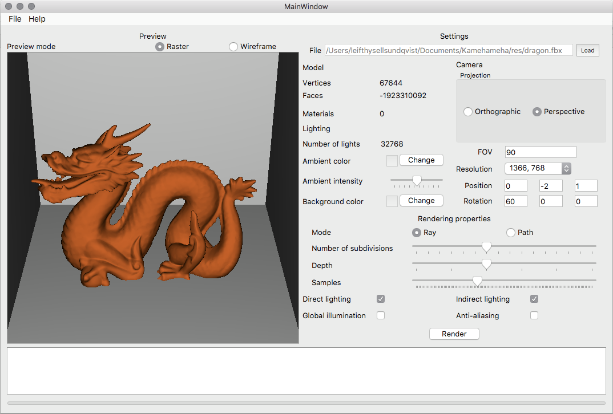
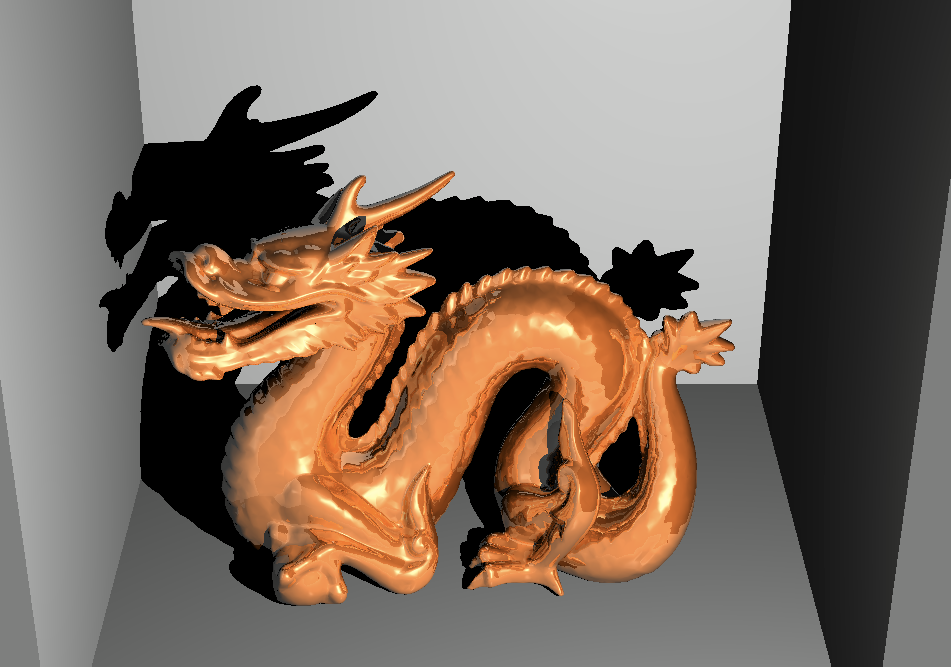
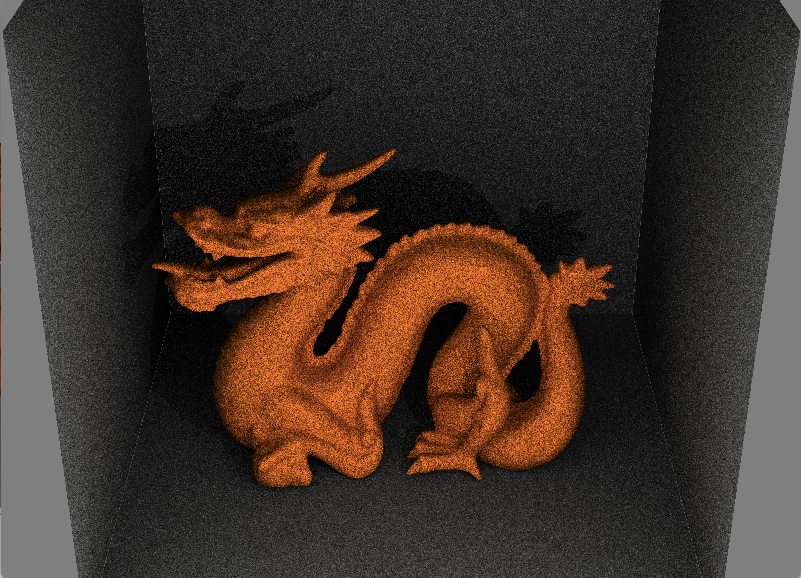

# Project Kamehameha

Kamehameha is a graphics engine developed as a hobby project during my first year as a master student at KTH.
My main source of knowledge for this project was [Scratchapixel's](https://www.scratchapixel.com/)  extensive series of articles on computer graphics and how various rendering techniques work

## Features

Kamehameha is capable of rendering Autodesk FBX scenes with the help of Autodesk's FBX SDK.

The GUI includes a main window with a preview panel in which the scene is rendered using either rasterization or wireframing.
The location and rotation of the camera can be adjusted and supports perspective as well as orthographic projection.

### Ray tracing

The ray tracing supports parameters such as depth (number of ray bounces) for reflections. Furthermore, the user may specify whether or not
to include direct and/or indirect lighting within the scene.

### Path tracing

The path tracing supports adjusting the number of samples for the Monte Carlo ray bounces as well as
specifying whether or not to use global illumination. Path tracing gives rise to much more natural lighting within the scene than
ray tracing does. However, using this technique is more time consuming.

### Optimizations
#### Multi-thread rendering
In order to speed up rendering the user may specify 
that the rendered image be subdivided and that each subdivision be rendered by a separate thread, 
starting at one at which point the image will be rendered on a single thread.

##### KD Trees
Kamehameha utilizes KD Trees, an idea that I received from Emma Carlson at [FrogSlayer](https://blog.frogslayer.com/kd-trees-for-faster-ray-tracing-with-triangles/).
KT Trees are binary trees in which nodes store triangles within the tree depending on their location 
relative to the longest axis of the triangles within the parent node. 

Though I haven't explicitly performed any benchmarking,
implementing KD Trees reduced ray- and path tracing times from several hours down to a handful of minutes.

### Development

Kamehameha was written in C++ using the Qt Creator development environment. 
All geometric primitives were written from scratch using linear algebra and the two fundamental classes Vector2D and Vector3D.

The Objparser class is, although under maintenance at the moment, yet functional in earlier commits, capable of parsing the .obj file format
as well as the .mtl format for materials.

[Autodesk's FBX SDK Documentation] contains extensive information on how to work with the FBX SDK.

### In the future
There are many things that I consider implementing in the future. The anti-aliasing as of now is not mature and so I would like to find
a more efficient method of performing it, as the current anti-aliasing used for the rendering is a very crude one.

I would also like to fix some minor artifacts such as the one where planes perpendicular to each other causes visible seams to appear and that
I have not yet taken the time to investigate.

### Other notes
All 3D models were either made myself in Blender, with the only exception being the famous [Stanford Dragon](http://graphics.stanford.edu/data/3Dscanrep/)

## Authors

Leif T. Sundkvist

## Acknowledgments

Special thanks to my fellow student Anders Eriksson for sharing my enthusiasm to start this project in the spring of 2017.
